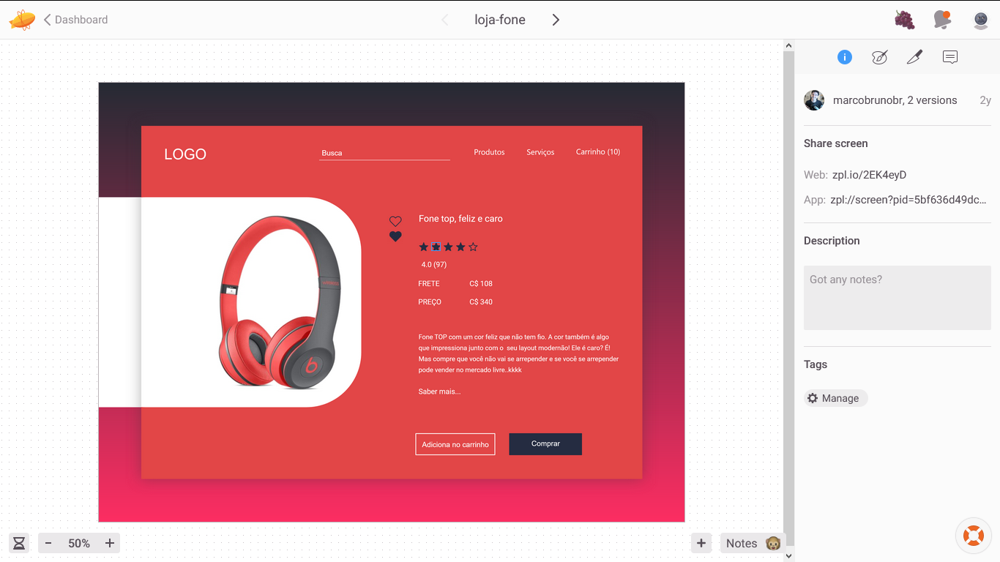

<h1 align="center">Curso da collabcode - Projeto Loja Fone</h1>

Aqui estou fazendo um curso de HTML CSS e JS. Estou fazendo um de projeto e-commerce de loja fone.

As principais tecnologias que serão utilizadas nesse curso:

- HTML (Semântico)
- CSS (Do básico ao avançado)
- JS (Do básico ao avançado)

