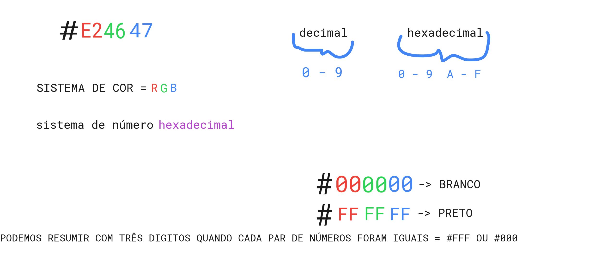

# Vida feliz com zeplin

O zeplin é uma ferramenta que é usada muito no mercado de trabalho. 

Chamamos as imagens de assets.

Aprende a como mexer no zeplin e no XD.

Quando que irei usar o zeplin? Quando eu trocar uma ideia com o design para saber mais detalhes do projeto. Ele vai passar para o programador informações do projeto. Fontes, tamanhos, posições, cores, larguras, alturas, imagens e tudo mais. Mas com o zeplin não precisa, basta apenas clicar no lugar em que você deseja e observa do lado direito os valores que ele possuí. Ao clicar em uma img você até pode fazer download.

A partir daqui, faça as anotações tanto aqui quanto no markdown para praticar os comandos da linguagem e também praticar os atalhos do vscode. 

Pesquisar sobre o figma e sketch -> Ferramenta para designer. 
Tudo no HTML se orienta da esquerda para a direita e de cima para baixo. 
Pesquisar atributos da tag e meta tag.

# Plugins e configs do VSCode

Aqui você vai instalar os plugins que o marco pediu no curso. Plugins do VScode. Você pode pesquisar agora ou durante as aulas.

## Começando com HTML

É uma linguagem de marcação que tem as seguintes responsabilidades: 

- Conteúdo;
- Semântico (Tags de formas corretas);
- Estrutura

*Por onde eu começo o site?* - Eu começo por uma sessão. Eu penso e divido o site em pequenas sessões, em grupos de conteúdo. No layout do zeplin temos três grandes sessões. Temos o header, a parte do produto e a parte dos botões. Começa sempre pelo o que está no topo. É mais fácil a gente ver dessa maneira. Então iremos começar pelo topo. 

-22:21 Tempo do vídeo - Verificar.

- `<h1>` - heading 1 - 6 Quando estamos escrevendo html para browser usamos no máximo o h3.
Usamos ele quando queremos definir títulos.

*Como ser faz uma tag?* - ```<nomedatag>Coiso</nomedatag``` Todas das tags tem começo e fim para saber onde começa e acaba.

O que é semântica? - 

Dentro das tags de abertura colocamos o que chamamos de atributos da tag.

*O que é atributos da tag?* - São características que a gente está adicionando a nossa tag. Sempre dentro da tag de abertura.
Como por exemplo a tag `<a>` tem o `href`.

Valores de atributos são sempre na tag de abertura.

- `<a>` - Link (a - anchor)
Usamos ela para definir uma navegação do usuário Se você tem um texto que você quer que o usuário clique nele e ele vá para outro lugar você pode usar essa tag junto com o atributo `href`. Exemplo de um `a` que o usuário é direcionado para o site da collabcode.training:

```html
<a href="http://collabcode.training">Collabcode</a>
```

*O que são tag de configuração?*

Tags de configuração não precisam ser fechadas.


## Começando com CSS

*Obs*: Lembrando que no curso irei separar os CSS por sessões. Por exemplo, tenho o header, então irei colocar `header.css` no nome do arquivo para separar. Você precisa lembrar disso.

## CSS 

Ou folha de estilo em cascata, é o código que você usa para dar estilo à sua página web. Noções básicas de CSS leva você através do que você precisa para começar. 

É uma linguagem de estilo, isso quer dizer que ela tem as seguintes responsabilidades;

- Visual;

Vamos fazer com que o header fique de cor de fundo vermelha. Como fazer isso? - 12:20

*O que é seletores de tag?*
  

## Reset.css

O reset.css é estilo que "limpa" os estilos padrões de todos os elementos HTML que já possuem uma formatação padrão. Ele tira cores, tamanhos de fonte, margins, paddins, efeitos e decorações… Quase tudo de quase todos os elementos vira “padrão”, como um texto sem formatação/alteração nenhuma. Com o reset.css, isso facilita e muito na hora de programar web para várias plataformas. Como por exemplo desktop e mobile.

Código do site aqui: https://meyerweb.com/eric/tools/css/reset/ <- Sempre utilize aqui.

*Obs*: Na hora de colocar o reset.css no html, colocar ele em primeiro lugar. Se não pode sobrescrever o seu código.

```html
 <head>
        <meta charset="utf-8" />
        <title>Loja de fone</title>
        <link rel="stylesheet" href="reset.css">
        <link rel="stylesheet" href="header.css">
</head>
```

# Cores, como funcionam?

#E24647 O que significa isso? Aqui estamos usando um sistema de cor. Mas qual é esse sistema? Ele se chama RGB. R = Red, G = Green, B = Blue. 

Junto com esse sistema de cor, temos um sistema numérico. Mas não é um sistema que estamos acostumados de ver. É um sistema hexadecimal. No dia a dia usamos o decimal que é de 0 a 9.

O hexadecimal é os 10 mais 6 dígitos. Ele tem uma base de 16 dígitos. Então ele tem os números de 0 a 9 mas também as letras de A a F.

O sistema RGB é representado por duplas de números e letras, então a primeira dupla é o vermelho, segundo é o verde, o terceiro o azul.

0 é o valor mínimo e o F é o valor máximo.

Exemplo: #0000FF -> Aqui estamos dizendo que não queremos nada de vermelho, nada de verde e o máximo de azul.

Mas o máximo de vermelho, verde e azul daria qual cor?
O mínimo de vermelho, verde e azul daria qual cor?

Se eu juntar todas as cores eu tenho preto, se eu não juntar nenhuma cor eu tenho branco.

Só que isso não é mistura de cor e sim de luz que emite cor.

Na auscencia de luz, quando você apaga a luz você enxerga preto. Se você ligar a luz você está mais possível do branco.

O monitor reage por luz e não por mistura de cor.

Se eu quiser só vermelho: #FF0000

Não é para dominar as cores, domine como funciona!

E temos a forma resumida. Por exemplo o branco #FFFFFF -> Se todas as duplas se repetem entre elas eu posso fazer assim: #FFF
Porque cada desses 3 f é por dupla. Posso fazer com o vermelho por exemplo: #F00 ou com o azul #00F .

#E24647 <- Entende como é a cor, mas não decora. Nesse exemplo vemos que ela tem muito vermelho porque ela tem um E. E = 14 no hexadecimal.





# Pixels no CSS é diferente

Pixel na programação é diferente do celular.

No celular o pixel se torna dinâmico, porque eles mudam quando o celular fica em pé ou deitado.

Entrando no site http://viewportsizes.mattstow.com/ vamos olhar o iphone 4 que é uma situação bem caótica.

A apple criou um lance chamado device width. Ele não é um pixel físico e sim virtual. É o pixel do CSS. Então você tem de área útil 320 pixel. 
No CSS o pixel é um pouco maior. A apple criou isso porque a resolução do celular estava muito próximo das resoluções dos monitores.

Explicação: -03:40 no vídeo. Segue


# Desafios

Básico: Colocar o tamanho das fontes igual do layout

Intermediário: Mudar o nome das fontes

Avançado: Colocar o logo do lado esquerdo e o link do lado direito.
